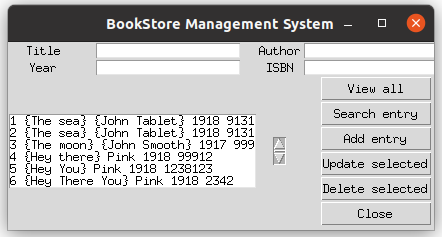

## BookStore-Management-System

The user can add, delete, search and view books stored in the database. The database contains Book's Title, Author, Year of publishing and ISBN number.   

## Built With
* Python
* Tkinter
* SQLite
